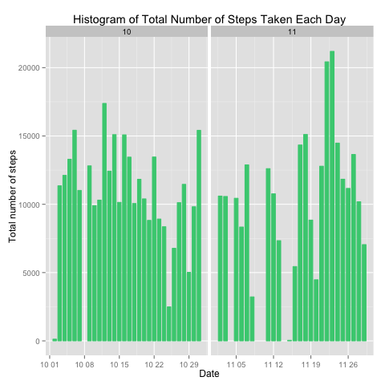
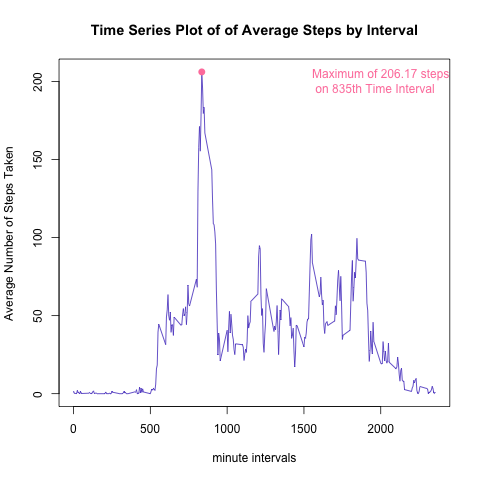
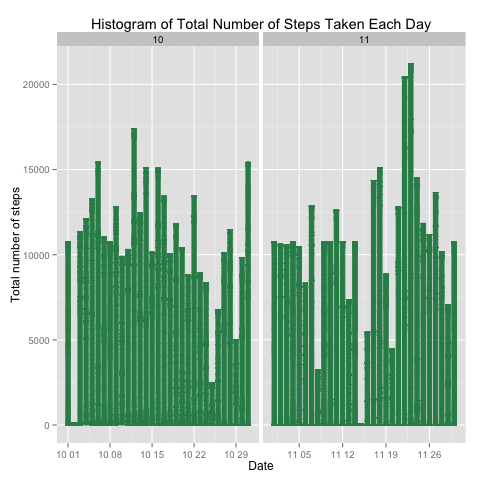
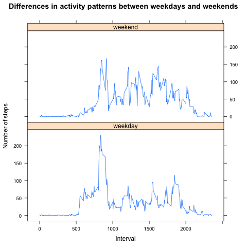

## Loading and preprocessing the data
```r
unzip("activity.zip")
ActivityData <- read.csv("activity.csv")

#Process/transform the data into a format suitable for analysis
ActivityData$date <- as.Date(ActivityData$date)
```


## What is mean total number of steps taken per day?
```r

sub <- subset(ActivityData, !is.na(ActivityData[,"steps"]))
TotalStepsPerDayTable <- aggregate(steps~date,data=sub,sum )
TotalStepsPerDayTable$month <- as.numeric(format(TotalStepsPerDayTable$date, "%m"))

#install.packages("ggplot2")
library(ggplot2)
ggplot(TotalStepsPerDayTable, aes(date, steps))+ geom_bar(stat = "identity", colour = "seagreen3", fill = "seagreen3", width = 0.7) + facet_grid(. ~ month, scales = "free") + labs(title = "Histogram of Total Number of Steps Taken Each Day", x = "Date", y = "Total number of steps")

mean(TotalStepsPerDayTable[,"steps"])   #10766.19
median(TotalStepsPerDayTable[,"steps"]) #10765


dev.copy(png, file="./figure/1_TotalStepsPerDayHistogram.png", height=480, width=480)
dev.off()

```  
 


## What is the average daily activity pattern?
```r
DailyStepsByInterval <- aggregate(steps~interval,data=sub,mean) #important function
plot(DailyStepsByInterval$interval,DailyStepsByInterval$steps,type="l",
	col = "slateblue3",lwd = 1.2,
    main="Time Series Plot of of Average Steps by Interval", 
	xlab="minute intervals", ylab="Average Number of Steps Taken", 
)

#find the max
maxSteps <-  max(DailyStepsByInterval$steps)
maxStepsInterval<-DailyStepsByInterval[DailyStepsByInterval$steps==maxSteps,]$interval
points(maxStepsInterval,maxSteps, col = 'palevioletred1', lwd = 2, pch = 19)

#Explanation String
label <- paste('Maximum of ', round(maxSteps,3) , ' steps \n on ',maxStepsInterval, 'th Time Interval', sep = '')
legend("topright",legend = label, text.col = 'palevioletred1', bty = 'n')

dev.copy(png, file="./figure/2_AverageStepsByInterval.png", height=480, width=480)
dev.off()

```  
 


## Imputing missing values
```r
sum(is.na(ActivityData))

#fill in avg data to NA
newData <- ActivityData 
for (i in 1:nrow(newData)) {
    if (is.na(newData$steps[i])) {
        newData$steps[i] <- DailyStepsByInterval[which(newData$interval[i] == DailyStepsByInterval$interval), ]$steps
    }
}
newData$month <- as.numeric(format(newData$date, "%m"))

ggplot(newData, aes(date, steps))+ geom_bar(stat = "identity", colour = "seagreen", fill = "seagreen", width = 0.7) + facet_grid(. ~ month, scales = "free") + labs(title = "Histogram of Total Number of Steps Taken Each Day", x = "Date", y = "Total number of steps")

mean(newData[,"steps"])  
median(newData[,"steps"]) 

dev.copy(png, file="./figure/3_TotalStepsPerDayHistogram_AfterFill-in.png", height=480, width=480)
dev.off()

```  

Do these values differ from the estimates from the first part of the assignment? 
What is the impact of imputing missing data on the estimates of the total daily number of steps?
```r
mean(newData[,"steps"])   #10766.19
median(newData[,"steps"]) #10765
```  
 


## Are there differences in activity patterns between weekdays and weekends?
```r
#create factor with 2 level: weekdays and weekends
newData$weekdays <- factor(format(newData$date, "%A"))
levels(newData$weekdays)
levels(newData$weekdays) <- list(weekday = c("周一", "周二",
                                             "周三", "周四", "周五"),
                                 weekend = c("周六", "周日"))
levels(newData$weekdays)
#table(newData$weekdays)

avgSteps <- aggregate(newData$steps, 
                      list(interval = as.numeric(as.character(newData$interval)), 
                           weekdays = newData$weekdays),
                      FUN = "mean")
names(avgSteps)[3] <- "meanOfSteps"
library(lattice)
xyplot(meanOfSteps ~ interval | weekdays, 
		data = avgSteps,
       layout = c(1, 2), type = "l", 
       main = "Differences in activity patterns between weekdays and weekends",
       xlab = "Interval", ylab = "Number of steps")
dev.copy(png, file="./figure/4_weekdayVSweekend.png", height=480, width=480)
dev.off()
```  
 


